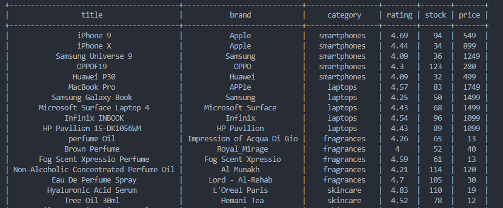

## API Data Analysis

In this repository, I'm gonna show you how you can get data from an API and display it in a table using <a href="https://pypi.org/project/prettytable/">PrettyTable</a> and the <strong>get</strong> method  

<table>
    <thead>
        <tr>
            <th>PrettyTable</th>
            <th>API</th>
        </tr>
    </thead>
    <tbody>
        <tr>
            <td>
                <a href="https://pypi.org/project/prettytable/">prettytable</a>
            </td>
            <td>
                <a href="https://dummyjson.com/products">dummyJSON</a>
            </td>
        </tr>
    </tbody>
</table>

#### So let's dive staight ☕

Dont't forget to leave me a start ⭐

You nedd to install:
> prettytable  by using `pip install prettytable`

<a href="https://bruxx.netlify.app"><brx>By BRUXX DEV </brx></a>